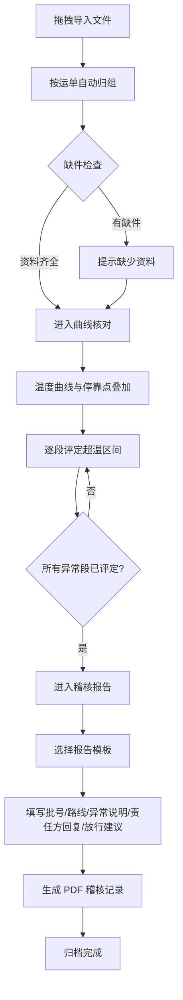

## 1. 产品概述

冷链稽核桌面客户端，面向疫苗生产企业质量保证部门，用于本地复核承运商交付的运输资料。系统聚焦资料导入、曲线核对和稽核报告三大核心环节，帮助稽核员高效完成从资料收集、异常判定到归档输出的完整稽核流程。

- 解决承运商交付资料分散、格式不一、人工核对效率低下的问题
- 目标用户：疫苗生产企业质量保证部门稽核员，市场价值在于降低超温漏检风险、提升稽核效率与合规性

## 2. 核心功能

### 2.1 用户角色

| 角色 | 使用方式 | 核心权限 |
|------|----------|----------|
| 稽核员 | 本地登录 | 导入资料、曲线核对、评定结论、生成报告 |
| QA 主管 | 本地登录 | 复核报告、审批放行建议、管理报告模板 |

### 2.2 功能模块

1. **资料导入页**：拖拽上传区、运单自动归组、缺件提示面板
2. **曲线核对页**：温度曲线与停靠点叠加时间轴、逐段评定面板、异常标注列表
3. **稽核报告页**：报告模板选择、报告内容编辑、PDF 导出与归档

### 2.3 页面详情

| 页面名称 | 模块名称 | 功能描述 |
|----------|----------|----------|
| 资料导入页 | 拖拽上传区 | 支持拖入温度记录（CSV/Excel）、GPS 轨迹（CSV/KML）、签收照片（JPG/PNG），自动识别文件类型 |
| 资料导入页 | 运单归组 | 按运单号自动将文件分组，显示每个运单的资料清单 |
| 资料导入页 | 缺件提示 | 对比必需资料清单，提示缺少的发车照片、到货签字或温度段 |
| 曲线核对页 | 时间轴画布 | 温度曲线与车辆停靠点叠加在同一时间轴上，支持缩放和平移 |
| 曲线核对页 | 逐段评定 | 稽核员逐段查看超温区间，判断是否发生在装卸区/服务区/接种点门口，添加"可接受""需说明""不合格"结论 |
| 曲线核对页 | 异常标注列表 | 汇总所有超温段和评定结果，支持快速跳转 |
| 稽核报告页 | 模板选择 | 选择企业预设的报告模板（简化版/完整版/法规合规版） |
| 稽核报告页 | 报告编辑 | 填写批号、路线、异常说明、责任方回复和放行建议 |
| 稽核报告页 | 导出归档 | 生成 PDF 稽核记录，适合企业内部质量归档 |

## 3. 核心流程

稽核员将承运商提供的温度记录、GPS 轨迹和签收照片拖入窗口 → 系统按运单自动归组并提示缺件 → 稽核员进入曲线核对页面，在时间轴上逐段查看超温与停靠点关系并评定 → 评定完成后进入报告页面，选择模板并填写内容 → 生成稽核记录 PDF 归档。

## 4. 用户界面设计

### 4.1 设计风格

- **主色调**：冰蓝色 (#0EA5E9) 象征冷链，搭配深灰 (#0F172A) 和冷白 (#F8FAFC)
- **辅助色**：警告用琥珀色 (#F59E0B)，不合格用红色 (#EF4444)，可接受用翠绿 (#10B981)
- **按钮风格**：圆角矩形，扁平化设计，主按钮填充色，次按钮描边
- **字体**：标题使用 DM Sans Bold，正文使用 DM Sans Regular，数据使用 JetBrains Mono
- **布局风格**：左侧侧边栏导航 + 右侧内容区，顶部步骤进度条
- **图标风格**：线性图标（Lucide），2px 描边

### 4.2 页面设计概览

| 页面名称 | 模块名称 | UI 元素 |
|----------|----------|---------|
| 资料导入页 | 拖拽上传区 | 虚线边框大区域，拖入时高亮，文件类型图标 + 文件名列表 |
| 资料导入页 | 运单归组 | 卡片列表，每张卡片显示运单号 + 文件缩略图 + 状态标签 |
| 资料导入页 | 缺件提示 | 右侧面板，红/黄标签标示缺失项，带补充上传按钮 |
| 曲线核对页 | 时间轴画布 | Canvas 区域，蓝色温度曲线 + 橙色停靠点标记，可缩放平移 |
| 曲线核对页 | 逐段评定 | 下方面板，超温段列表 + 三态按钮（可接受/需说明/不合格） |
| 曲线核对页 | 异常标注列表 | 右侧浮层，点击跳转到对应时间轴位置 |
| 稽核报告页 | 模板选择 | 模板卡片横排，选中高亮边框 |
| 稽核报告页 | 报告编辑 | 表单布局，分组输入框 + 富文本异常说明 |
| 稽核报告页 | 导出归档 | 底部操作栏，预览按钮 + 导出 PDF 按钮 |

### 4.3 响应式设计

- 桌面优先设计，最小宽度 1280px
- 侧边栏可折叠，内容区自适应宽度
- 曲线核对页时间轴支持全屏模式

### 4.4 3D 场景指引

不适用
