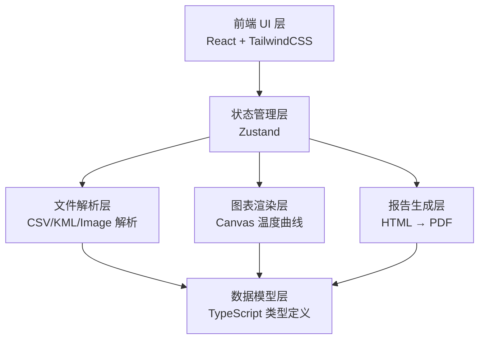
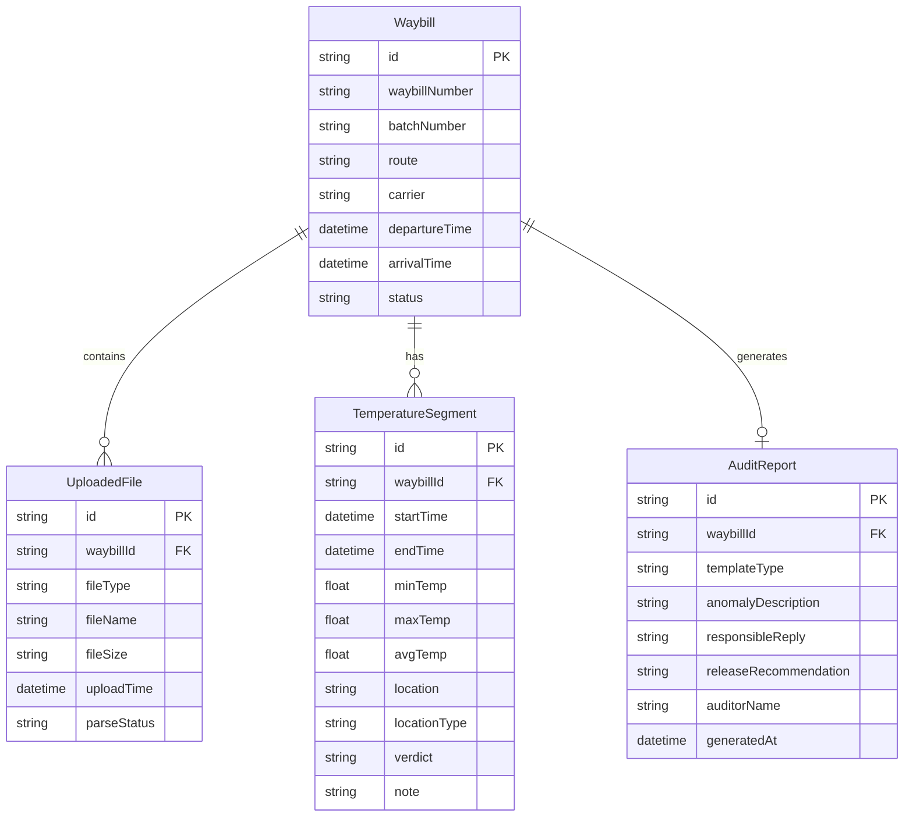

## 1. 架构设计

纯前端应用，所有数据处理在本地完成，不依赖后端服务。

## 2. 技术说明

- **前端**：React@18 + TailwindCSS@3 + Vite + TypeScript
- **初始化工具**：vite-init (react-ts 模板)
- **后端**：无（纯前端本地应用）
- **数据库**：无（使用 Zustand 持久化 + localStorage 存储稽核数据）
- **图表库**：Canvas API 自绘温度曲线（轻量、高性能）
- **PDF 生成**：html2canvas + jsPDF 或浏览器原生 window.print()
- **文件解析**：PapaParse（CSV）、xlsx（Excel）、@tmcw/togeojson（KML）

## 3. 路由定义

| 路由 | 用途 |
|------|------|
| / | 首页/仪表盘，显示稽核任务列表 |
| /import | 资料导入页面，拖拽上传与运单归组 |
| /verify/:waybillId | 曲线核对页面，温度曲线与停靠点叠加 |
| /report/:waybillId | 稽核报告页面，模板选择与报告生成 |

## 4. API 定义

无后端 API，所有数据通过本地文件解析获取，稽核状态通过 Zustand store 管理。

## 5. 服务端架构图

不适用（纯前端应用）

## 6. 数据模型

### 6.1 数据模型定义

### 6.2 数据定义语言

使用 TypeScript 接口定义，通过 Zustand persist 中间件存储到 localStorage：

- Waybill：运单主表，id 为 UUID
- UploadedFile：上传文件表，fileType 枚举为 temperature_record / gps_track / departure_photo / arrival_photo / signature_photo
- TemperatureSegment：温度段表，locationType 枚举为 loading_area / service_area / vaccination_point / highway / other，verdict 枚举为 acceptable / needs_explanation / unqualified
- AuditReport：稽核报告表，templateType 枚举为 simplified / full / compliance
